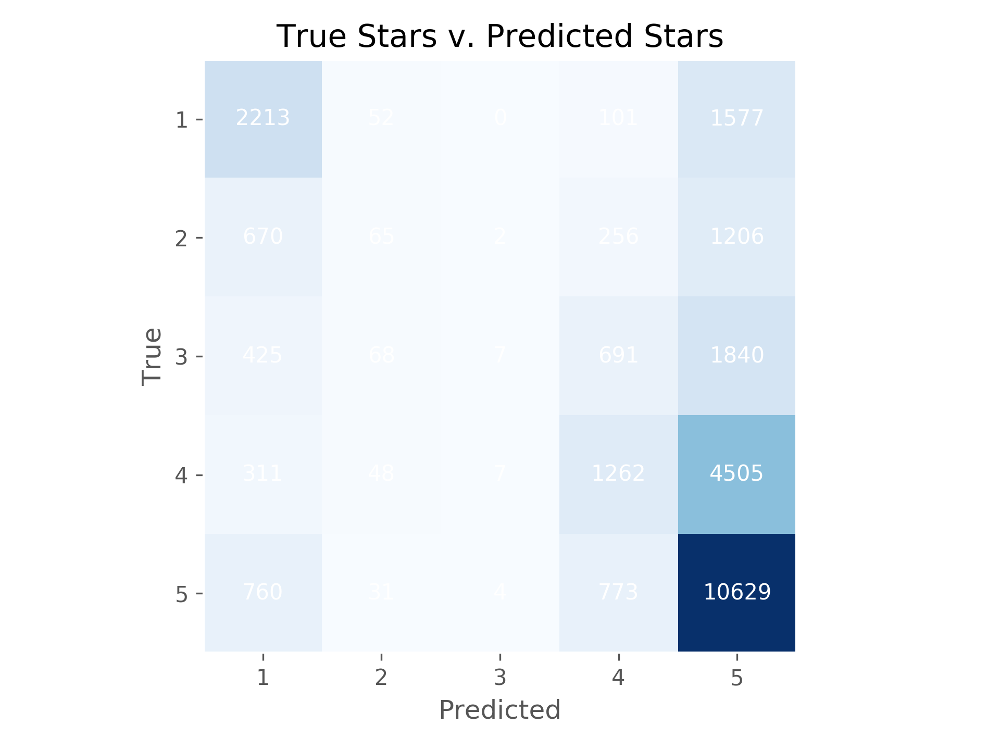

## Multinomial Classification of Text with Spark and Tensorflow

#### This project aims at predicting a yelp review's stars

[data source](https://www.kaggle.com/yelp-dataset/yelp-dataset#yelp_academic_dataset_review.json
)

Spark MLlib is utilized to vectorize the text, and a Sequential Tensorflow model is used to predict the number of stars.

There is Flask for simple api endpoint usage of the model. Flask must be ran unthreaded for the Tensorflow model to work.

Here is a confusion matrix to explain the model's performance. A perfect model will have all the documents running down the diagonal, and zeros elsewhere.

